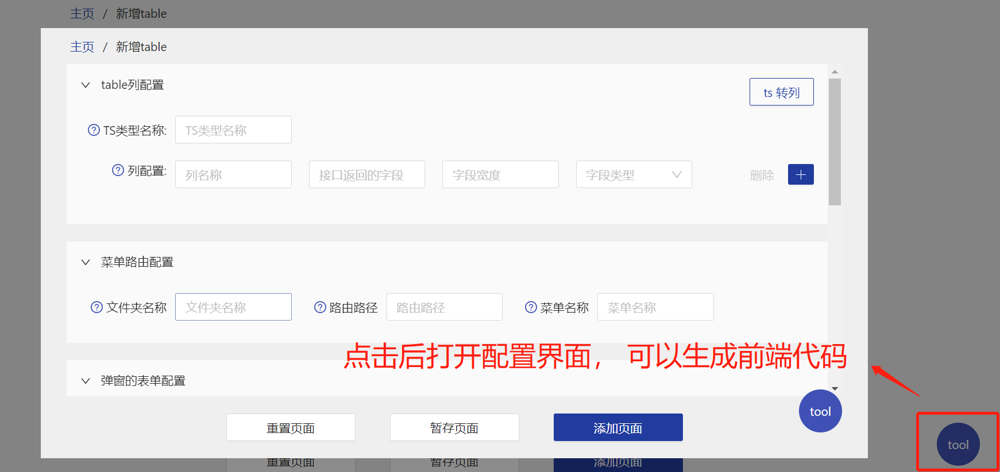

# vite 开发者插件

## 使用之前

```
yarn lcr-tools-service vite-plugin-dev-tool -D
```

1. 需要先安装 lcr-tools-service， 该工具执行 npm run dev-service-start 后， 会在本地开启一个服务， 端口是 http://localhost:3030/；

2. 配置 vite

```ts
import { htmlTransformByDevTools } from "vite-plugin-dev-tool";
export default defineConfig({
  plugins: [
    react(),
    htmlTransformByDevTools(), // 使用开发者工具
  ],
});
```

3. 配置上面之后， 开发时， 左下角会多次一个按钮， 点击会打开 http://localhost:3030/ 页面， 这时就可以配置生成前端代码


